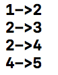

# # BreadthFirstSearch

- 너비우선탐색(Breadth First Search): 맹목적 탐색방법의 하나로 시작 정점을 방문한 후 시작 정점에 인접한 모든 정점들을 우선 방문하는 방법 (위키백과 참조)

https://github.com/dely2p/swift-Algorithm/blob/master/SelectionSort.playground/Contents.swift

```swift

import UIKit

// Breadth First Search
let N = 6
let list = [[0,0,0,0,0,0,0],
            [0,0,1,0,0,0,0],
            [0,1,0,1,1,0,0],
            [0,0,1,0,0,0,0],
            [0,0,1,0,0,1,0],
            [0,0,0,0,1,0,0],
            [0,0,0,0,0,1,0]]
var visitFlag = [Int]()

func run() {
    visitFlag = [Int](repeating: 0, count: N)
    BreadthFirstSearch(node: 1)
}

func BreadthFirstSearch(node: Int) {
    visitFlag[node] = 1
    for index in 1...N {
        if list[node][index] == 1 && visitFlag[index] == 0 {
            print("\(node)->\(index)")
            BreadthFirstSearch(node: index)
        }
    }
}

run()

```
<br  /><br  />
[ 실행결과 ]<br  />

