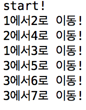

# # DFS(Depth First Search)

- 깊이우선탐색(Depth First Search): 트리, 그래프 등을 탐색하는 알고리즘. 길찾기 할 때 쓰기도 함

```java

public class dfs {
	static int[] search = new int[10];
	static int[][] DFS = {
	        {0,0,0,0,0,0,0,0},
	        {0,0,1,1,0,0,0,0},
	        {0,1,0,0,1,0,0,0},
	        {0,1,0,0,0,1,1,1},
	        {0,0,1,0,0,0,0,0},
	        {0,0,0,1,0,0,0,0},
	        {0,0,0,1,0,0,0,0},
	        {0,0,0,1,0,0,0,0},
	};
	
	public static void DFS(int v) {
		search[v] = 1;
		for(int i=1; i<=7; i++) {
			if(search[i] != 1 && DFS[v][i] == 1) {
				System.out.println(v+"에서"+i+"로 이동!");
				DFS(i);
			}
		}
	}

	public static void main(String[] args) {
		System.out.println("start!");
		DFS(1);
	}

}
```
<br  /><br  />
[ 실행결과 ]<br  />

