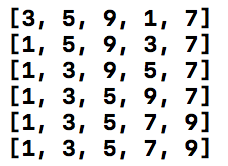

# # Quick Sort

- 퀵정렬(Quick Sort): 정렬되지 않은 데이터들에 대해 가장 작은 데이터를 찾아 가장 앞의 데이터와 교환해나가는 방식<br  />
(naver 지식백과 참고)

https://github.com/dely2p/swift-Algorithm/blob/master/SelectionSort.playground/Contents.swift

```swift

import UIKit

// Selection Sort

func run() {
    let list = [5, 3, 9, 1, 7]
    let result = selectionSort(list: list)
    print(result)
}

func selectionSort(list: [Int]) -> [Int] {
    var list = list
    for index in 0..<list.count-1 {
        for anotherIndex in index..<list.count {
            if list[anotherIndex] < list[index] {
                list.swapAt(anotherIndex, index)
                print(list)
            }
        }
    }
    return list
}

run()

```
<br  /><br  />
[ 실행결과 ]<br  />

