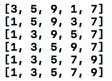

# # Recursive Function Sort

- 재귀 소팅(RecursiveFunction Sort): 함수 자기 자신을 다시 불러서 소팅하는 것<br  />

https://github.com/dely2p/swift-Algorithm/blob/master/SelectionSort.playground/Contents.swift

```swift

import UIKit

// Recursive Function Sort

func run() {
    let list = [5, 3, 9, 1, 7]
    let result = recursiveSort(list: list, index: 0)
    print(result)
}

func recursiveSort(list: [Int], index: Int) -> [Int] {
    let index = index
    var list = list
    if index > list.count-1 {
        return list
    }else {
        for itemIndex in index..<list.count {
            if list[index] > list[itemIndex] {
                list.swapAt(index, itemIndex)
            }
        }
        list = recursiveSort(list: list, index: index+1)
    }
    return list
}

run()

```
<br  /><br  />
[ 실행결과 ]<br  />

