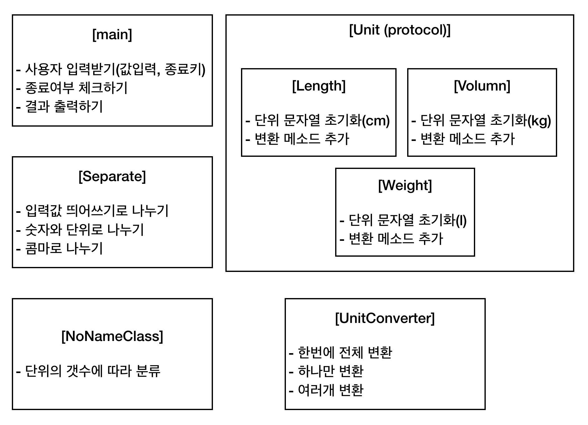

# # 단위 변환기 (ConvertUnit)
2018.02.05 코드 분석

---

- ### 기간
 : 2017.10.16 - 2017.10.24
- ### 느낀점
 : swift로 프로그램을 만들어 본 것은 처음이었다.   처음에는 단순히 cm -> m, m -> cm 였기 때문에 사실 문제를 만만하게 보기도 했다. 소수점이 나오면 그냥 C언어에서 하던대로 double이나 float형으로 변환해주면 되겠지라는 생각에서였다.
  swift에는 나의 발목을 붙잡는 것이 있었는데 **옵셔널(Optional)**이라는 것이었다. 변환이 안되면 프로그램이 멈추던, 에러를 내뱉던 하는 C언어와는 달리 `너무 친절`하여 나를 힘들게 했다. 이 당시에는 **옵셔널 언래핑(Optional Unwrapping)**을 나의 구원자로 삼고 마구마구 썼지만 지금 보면 조금 부끄럽기도 하다;;

---

- ### 코드 분석
: 내가 짰던 코드는 main, Length, Weight, Volume, Separate, UnitConverter Class로 분류된다.

  위의 그림처럼 클래스 별로 기능을 구현했는데, 좀 더 자세한 구조를 위해 데이터를 주고받는 것을 화살표로 그리고 싶었지만 지금 다시 보니 너무 복잡해서 그림으로 그리기 어려웠다;;
   그 때 당시에 나름 열심히 구현한 단위 변환기지만 다시보니 못쓰겠다..(셀프디스;;) 그래도 swift로 처음 프로그램을 만들어서 완성시켰다는 것은 뿌듯하기도 하고 대견하기도 하다.

> 다만 약 3달이 지난 지금 상황에서 구조적으로나 문법적으로 개선해야할 것들이 많이 보인다. 셀프 코드리뷰를 해보자면..
  
  1. 입력값 받는 것을 main에서 구현할 것이 아니라 InputView를 만들어야 함.
  : 입력 받는 것을 Controller에 해당하는 main에서 하기에는 구조가 복잡해지고, 재사용성이 어렵기 때문에
  
  2. Lenght, Volumn, Weight가 같은 구조이기 때문에 Unit이라는 프로토콜을 쓴 것은 좋다. 그러나 프로토콜의 특성을 잘 살리지 못했기 때문에 차라리 슈퍼클래스를 써서 상속받아서 쓰는 게 낫지 않았을까 하는 생각이 든다.
  
  3. 변수명, 메소드 이름이 모호하다. 나름 고심한 흔적이 있지만 아직도 모호하다. (프로토콜명과 단위 클래스의 속성명이 같기도하다...)
  
  4. 딕셔너리의 키값과 각 단위 클래스의 속성을 직접 비교해서 해당 값을 가져오도록 만들었는데, 보통 클래스의 속성은 private으로 두기때문에 다른 방법을 사용해야하지 않을까
  
  고칠 게 많지만 일단 이 정도로 정리해 본다.
  
  ---
