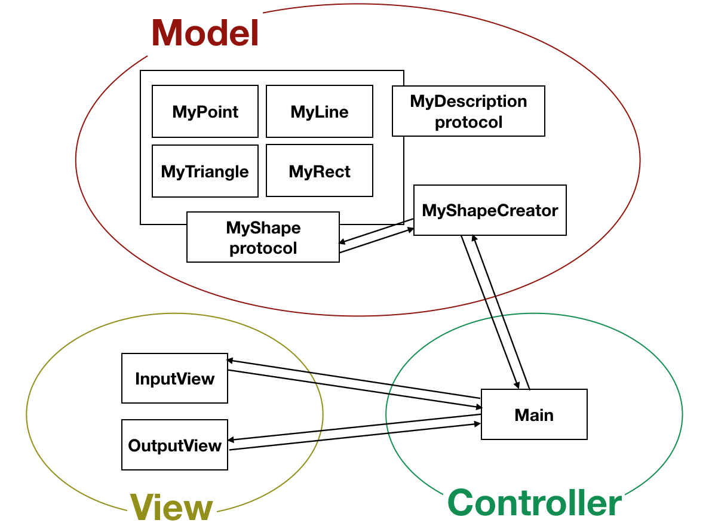

# CodeSquad_Swift > Level2 > Coordinate
# # 좌표계산기 (swift-coordinate)
https://github.com/dely2p/swift-coordinate

  2018.02.21 코드 분석

---

- ### 기간
 : 2017.11.06 - 2017.11.17
- ### 느낀점
 : 이 좌표계산기 과제를 수행하면서는 이전 과제에서 피드백 받았던 것을 적용하려고 많은 노력을 했다. 메소드 분리나, 변수명의 구체성, 객체 나누기 등.. 그리고 이 과제를 수행하면서는 커밋을 작업에 따라 세부적으로 나누어서 작성하고, 왠만하면 강제 옵셔널을 사용을 지양하는 것, 예외처리를 배울 수 있었다. 그리고 프로토콜로 인터페이스 추상화를 통해 내부 속성과 상관없이 데이터를 넘겨줄 수 있고, 두개의 다른 프로토콜을 `&`를 이용하여 함께 사용함으로써 outputView에서 각각에 맞게 좀 더 효율적으로 두 개의 프로토콜을 사용할 수 있다는 것도 배울 수 있었다.
  또한 Git 사용을 하면서 가끔씩 rebase를 하지않아 코드가 꼬이기도 했지만 그에 따른 해결방법도 배울 수 있었다.

---

- ### 코드 분석

: 내가 짰던 코드는 main, MyPoint, MyLine, MyTriangle, MyRect, MyShapeCreator, InputView, OutputView struct와 MyShape, MyDescription protocol 로 나누어진다.  

 > 각 클래스를 설명하자면,
 
 main: InputView와 MyShapeCreator, OutputView를 사용할 수 있도록 중간다리 역할의 컨트롤러 
    InputView: 좌표입력을 받는 뷰 
    OutputView: 좌표를 ANSI Code를 이용해 출력해주는 뷰 
    MyPoint: 좌표입력을 한 개 받았을 때 (점의 객체) 
    MyLine: 좌표입력을 두 개 받았을 때 (선의 객체) 
    MyTriangle: 좌표입력을 세 개 받았을 때 (삼각형의 객체) 
    MyRect: 좌표입력을 네 개 받았을 때 (사각형의 객체) 
    MyShapeCreator: 입력받은 좌표가 정상값인지 여부를 체크하고, '-'와 ','를 기준으로 분리하여 MyShape 타입으로 리턴하는 역할 
    MyShape: 프로토콜로 calculateOfPosition()과 resultOfMyShape()의 메소드를 갖고 있다. MyPoint, MyLine, MyTriangle, MyRect에서 사용한다. 
    MyDescription: 프로토콜로 출력문구를 만드는 resultDescription 프로퍼티를 갖고있다. MyPoint, MyLine, MyTriangle, MyRect에서 사용한다.  

  > 셀프 코드리뷰를 해보면..

1. inputView가 깔끔해졌다. 정말 input만 받는다. 또한 입력값이 nil값일 때를 대비하여 옵셔널 바인딩을 사용할 줄 알게 되었다.(셀프기특)

2. 아쉬운 부분은 한 메소드 내에 코드의 길이가 길다는 것이다. 각 기능 별로 메소드 분리가 필요해 보인다. MyShapeCreator클래스의 createMyShape() 메소드 같은 경우는 무려 30줄이다.
  
  ---
