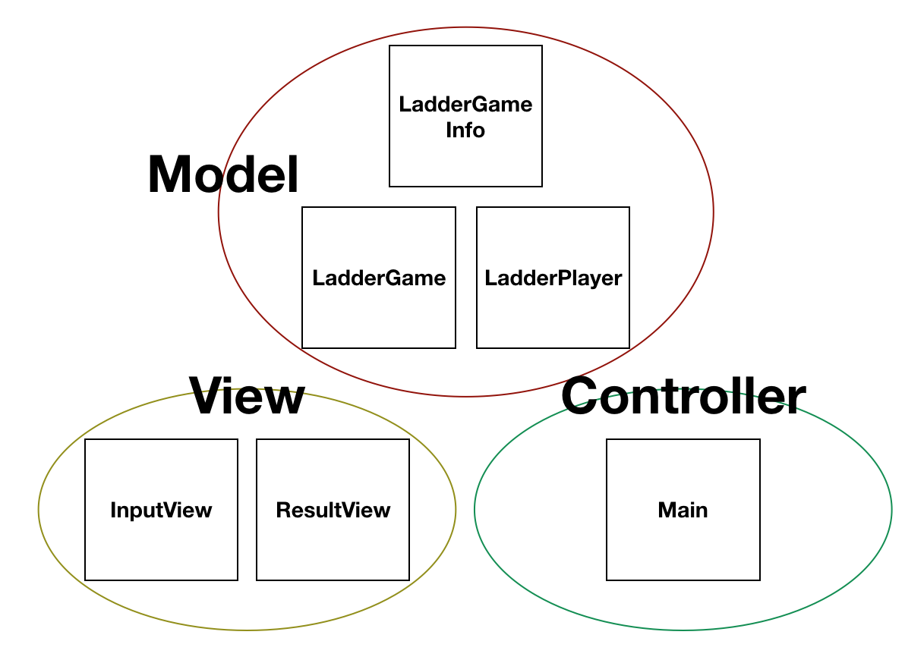

# # 사다리 게임 (swift-laddergame)
https://github.com/dely2p/swift-laddergame

  2018.02.20 코드 분석

---

- ### 기간
 : 2017.10.26 - 2017.11.06
- ### 느낀점
 : 이 프로젝트부터 JK의 코드리뷰를 받기 시작했다.
    변수명도 personNum, rndNum, j와 같이 작성했던 나의 잘못된 습관도 고치게 되었고, 입력과 출력을 하나의 메소드에서 몽땅 동작하도록 만들었던 것들을 메소드 분리를 통해 간략하게 만드는 방법도 배우고, 불필요한 코드를 줄여서 한눈에 코드가 들어오도록 개선할 수 있었다. 또 UnitTest도 생전처음으로 해보게 되었다.
    사실 당시 가장 어려웠던 것은 자바에서 get, set으로 클래스 내 속성값을 사용하던 옛 지식과, 접근 제어를 private으로 두지 않고 직접 접근해서 마구잡이로 사용했던 못된 옛 습관 덕분에 `Data Object`를 이해하는 데 한참 걸렸다. 내 머릿속에 어렴풋이 남아있는 DTO가 알고보니 Data Object과 같았는데, 특히 swift는 객체로 데이터를 넘기고 사용하는 것을 더 선호한다는 것을 이 때 배울 수 있었다. ~~(사실 아직도 프젝을 하며 배우고 있다..)~~

---

- ### 코드 분석

: 내가 짰던 코드는 main, InputView, ResultView, LadderGame, LadderGameInfo, LadderPlayer 클래스로 나누어진다.
사실 그 때 MVC로 나누어서 만든 것은 아닌데.. 내가 지금 분석하다보니 MVC로 나뉘어 지는 것 같아서 원형으로 묶어보았다.

  
 > 각 클래스를 설명하자면,
 
 main: 사용자 입력과 게임동작 그리고 결과 출력 전반을 컨트롤 하는 컨트롤러 역할
 InputView: 사용자에게 참여자 이름과 사다리 높이를 입력받는 역할 (입력 받을 때 space를 기준으로 분리하는 메소드도 포함)
 
 ResultView: 사다리 게임을 출력하는 역할
 LadderGameInfo: Data object로 InputView에서 LadderGame로 참여자 수와 사다리 높이 데이터를 넘길 때 사용된다.
 LadderGame: 사다리 게임에서 step의 유무를 랜덤으로 정해주는데, LadderGameInfo를 이용하여 랜덤값을 생성하는 역할
 LadderPlayer: 참여자의 이름을 가지고 있는 DataObject로 이름을 return하는 메소드를 가지고 있다.

  > 셀프 코드리뷰를 해보면..

1. JK 코드리뷰로 코드가 엄청 많이 깔끔해지고 간결해졌다. 이전에는 메소드의 매개변수나 초기화를 통해 데이터를 넘겨줬었는데, Data Object를 사용하니 다른 클래스에서 data를 사용할 때도 편리하고 다른사람(4개월 후의 나를 포함)이 보기에도 이해가 쉬운 코드가 되었다.(셀프칭찬)

2. 조금 안타까운 것은 UnitTest이다. 당시에는 test 메소드명을 영어로 무조건 써야한다는 생각에 `testLadderGameIsMakingNewRandomValue()` 이런식으로 썼었는데 지금 보니 `LadderGame_랜덤값이_매번_새롭게_생성되는지_확인()`과 같이 눈에 띄게 작성하는 것이 더 좋았겠다.

3. UnitTest에서 하나의 메소드의 코드길이가 매우 길다. 왜냐하면 값을 비교하기 위해 같은 동작을 나열해서 쭉 써놨기 때문이다. 아까 '읽기좋은코드가 좋은코드다'라는 책에서 보니 UnitTest도 반복되는 동작은 메소드를 하나두어 사용하는 것이 효율적이라고 했는데, 이것이 그에 해당하는 것 같다.
  
  ---
