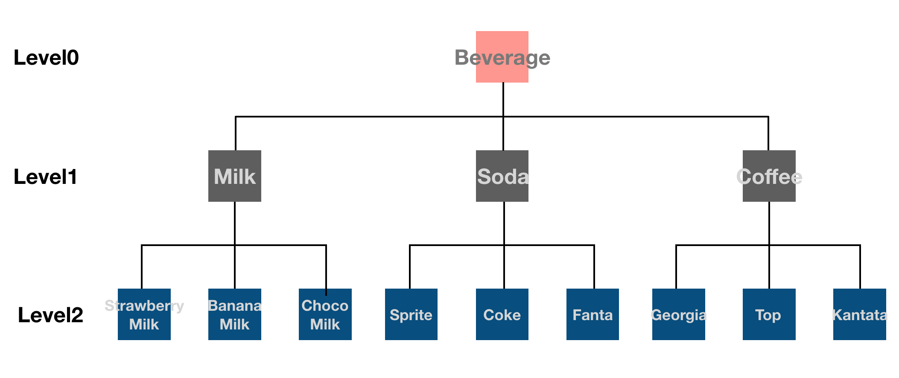

# # Step1. 시작하기 - 아이패드 앱

> 개발한 것(배운 것)

: VendingMachineApp은 콘솔창으로 개발했었던 음료자판기를 아이패드 앱으로 개발하는 미션이다.
그래서 기존에 MVC 패턴으로 만들었던 여러 클래스 중 Model에 해당하는 것을 프로젝트 파일로 넣고, Controller(main)에 해당하는 것을 ViewController에 작성하였다.<br  />
일단 step1에서의 미션은 콘솔창에 음료 객체의 정보를 출력하는 것이기 때문에 뷰가 뜬 후에 동작하는 override func viewDidLoad() 메소드에 음료객체 생성 및 재고추가와 콘솔창 출력기능을 모두 만들었다.<br  />


> 피드백

https://github.com/dely2p/swift-vendingmachineapp/issues/4

1. override var description: String { } 중복된 코드 개선하기

```
@godrm
지금 보니 여기 override var description: String { } 모두 중복된 코드네요.
좋은 방법이 있을까요?
```

> 알게 된 것

음료수 객체들의 구조는 다음과 같다.<br  />
<br  />
description 프로퍼티는 Beverage에서 각 음료수 객체에 override 되어 있고, 각 Level 별로 desciption에 들어가는 내용이 다르다.<br  />
피드백의 내용은 Level2에 있는 각 객체들의 description이 중복된 코드인데 코드를 줄이는 방법에 대해서 생각해보라고 하셨다.<br  />
<br  />
프로토콜을 하나 만들어서 중복되는 코드를 넣어서 상속받자니 description에서 사용하는 super에 접근할 수가 없고, 그렇다고 Root인 Beverage의 description을 변경하자니 내용이 다르기 때문에 안되고... 어찌하나.. 고민고민하다가..<br  />
왠지 override한 description을 overload하면 안될까... 하는 생각까지 이어졌다. 그래서 JK에게 말씀드렸더니 그건 좀 오버인 것 같다고..ㅠㅠ<br  />
결과적으로 방법은 Level1에서 메소드를 하나 새로 만들어서 super에 접근하는 속성들을 넣고, Level2에서 그것을 사용하는 것이었다. 메소드를 하나 새로 만들 생각은 못하고 원래 있던 것을 계속 어떻게 사용해야하나.. 하는 생각에 빠져있던 것 같다ㅠㅠ<br  />
