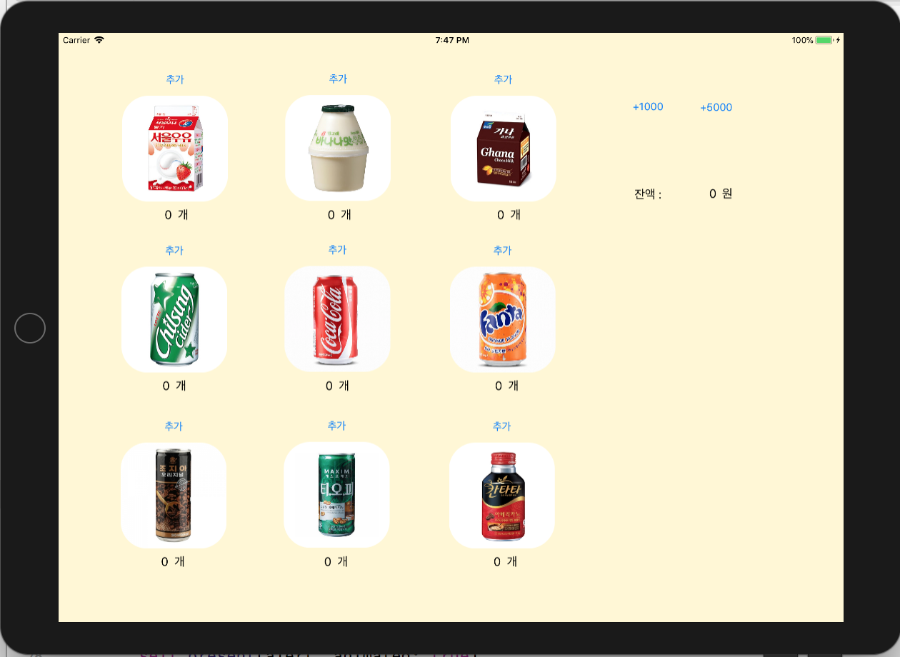

# # Step2. 시작하기 - 아이패드 앱

> 개발한 것(배운 것)

: VendingMachineApp step2에서는 storyboard에서 앱 뷰를 만들고 버튼과 라벨을 ViewController와 연결해서 코드를 작성하여 기능을 만드는 것이다. 안드로이드 앱 개발과는 달리 control key와 마우스로 해당 UI를 끌어다가 코드 작성 화면에 놓으면 연결되기 때문에 참 쉽다. 
그래서 내가 만든 storyboard는 다음과 같다. 
 

1. alert

2. IBOutlet Collection

> 피드백

https://

1.

> 알게 된 것

