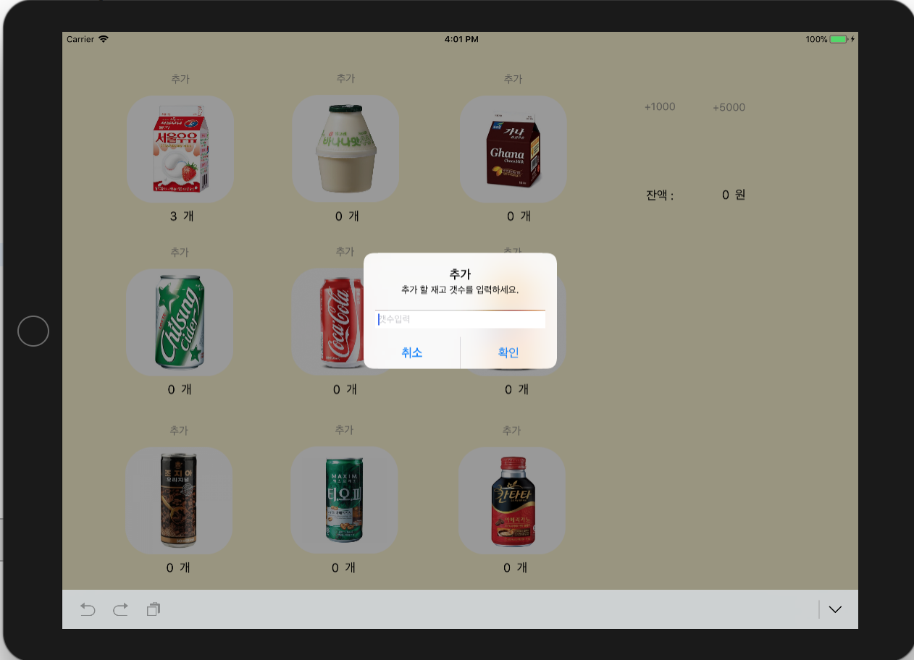

# # Step3. 앱 생명주기와 객체 저장

> 개발한 것(배운 것)

: VendingMachineApp step3에서는 앱의 데이터를 저장하기 위해 아카이빙을 하고 저장한 데이터를 가져오기 위해 언아카빙을 하는 것을 만들었다. 앱 생명주기에 맞춰서 그 코드들을 넣어줬고 각 모델마다 NSObject와 NSCoding 프로토콜을 넣고 encode() init() 코드를 구현해주었다.

사실 Codable을 사용해보려 했지만 encode, decode 


1. alert<br  />
: alert는 형식이 정해져있어서 형식대로만 작성하면 되는 것 같다.<br  /><br  />
<br  />
```swift
func alertCountOfBeverage(type: TypeOf) {
        let title = "추가"
        let message = "추가 할 재고 갯수를 입력하세요."
        let alert = UIAlertController(title: title, message: message, preferredStyle: .alert)
        let cancel = UIAlertAction(title: "취소", style: .cancel)
        let ok = UIAlertAction(title: "확인", style: .default) {(_) in
            if let inputValue = alert.textFields?[0] {
                guard let numberOf = Int(inputValue.text ?? "0") else {
                    return
                }
                let beverageName = self.vendingMachine.choiceBeverageData(menuType: type)
                self.vendingMachine.addInInventory(beverageName: beverageName, number: numberOf)
                self.updateCountOfEachBeverage(vendingMachine: self.vendingMachine)
            }
        }
        alert.addAction(cancel)
        alert.addAction(ok)
        alert.addTextField(configurationHandler: {(text) in
            text.placeholder = "갯수입력"
        })
        self.present(alert, animated: true)
    }
```
<br  /><br  />
2. IBOutlet Collection<br  />
: 여러개의 버튼을 한꺼번에 순서대로 정의하고 싶을 때 사용할 수 있다.
실제로 `@IBOutlet var countOfMenu: [UILabel]!` 이러한 형태로 만들어지는데 for문을 사용하여 배열처럼 해당 라벨, 이미지 등등에 접근할 수 있다.
```swift
@IBOutlet var imageOfMenu: [UIImageView]!
for (index, menu) in TypeOf.kind.enumerated() {
            countOfMenu[index].text = String(vendingMachine.beverageNumberOf(menuType: menu))
        }
```

<br  />
> 피드백

https://github.com/dely2p/swift-vendingmachineapp/issues/10<br  />
https://github.com/dely2p/swift-vendingmachineapp/issues/11<br  />
https://github.com/dely2p/swift-vendingmachineapp/issues/12<br  />

<br  />
1. 음료수 type을 넣었던 enum을 기존 VendingMachine 코드를 사용하여 수정하기<br />
2. countOfEachBeverage 배열도 기존 코드 써서 수정하기
<br  />
3. IBAction 반복되는 코드 한꺼번에 처리하기

```swift
VendingMachineApp/VendingMachineApp/ViewController.swift
	
+    
+    @IBAction func addMenu9(_ sender: Any) {
+        alertCountOfBeverage(type: TypeOf.kantanta)
+    }
```

```swift
@godrm
여기 액션들도 반복되는 코드처럼 보이는데 한꺼번에 처리하려면 어떻게 해야할까 고민해보세요.
```

<br  />
> 알게 된 것

1. IBOutlet collection 뿐만 아니라 IBAction도 동일하게 여러개의 버튼에 한꺼번에 접근할 수 있었다. (storyboard에서 각 버튼의 태그를 지정해준 후 for문에서 sender.tag로 눌러진 버튼을 구분할 수 있음)

```
@IBOutlet var addNumberOfMenu: [UIButton]!
@IBAction func addBeverage(sender: UIButton) {
    var type = TypeOf.otherBeverage
    for button in addNumberOfMenu where button.tag == sender.tag {
        type = vendingMachine.typeSelector(tag: button.tag)
    }
    alertCountOfBeverage(type: type)
}
```
