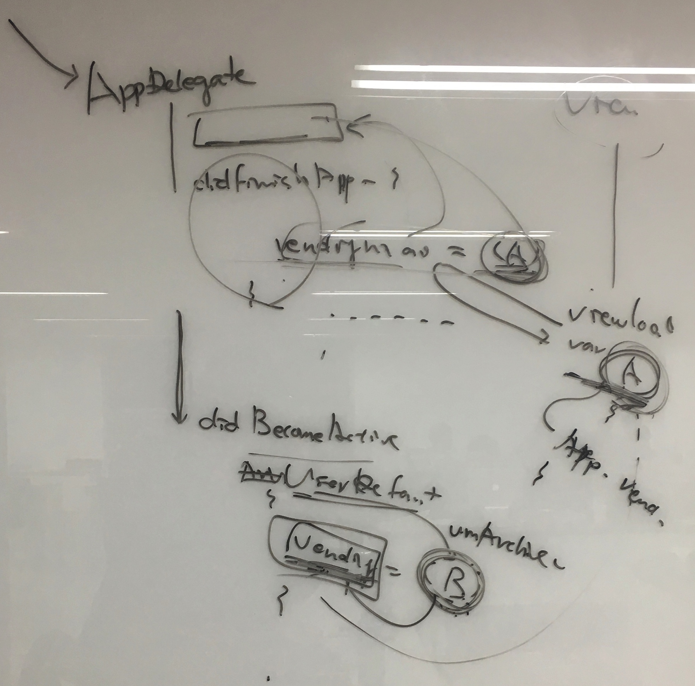

# # Step3. 앱 생명주기와 객체 저장

> 개발한 것(배운 것)

### 1. NSObject와 NSCoding 프로토콜

: VendingMachineApp step3에서는 앱의 데이터를 저장하기 위해 아카이빙을 하고 저장한 데이터를 가져오기 위해 언아카빙을 하는 것을 만들었다. 앱 생명주기에 맞춰서 그 코드들을 넣어줬고 각 모델마다 NSObject와 NSCoding 프로토콜을 넣고 encode() init() 코드를 구현해주었다.

사실 Codable을 사용해보려 했지만 데이터를 Json형식이나 다른 형태로 바꿔주는 데 더 적합한 프로토콜 같아서.. 많은 중복 작업이 있었지만 열심히 NSObject와 NSCoding 프로토콜로 만들었다. 

```swift
class VendingMachine: NSObject, NSCoding {
	required init?(coder aDecoder: NSCoder) {
	        coins = aDecoder.decodeInteger(forKey: "coins")
	        inventoryBox = (aDecoder.decodeObject(forKey: "inventoryBox") as? InventoryBox)!
	        purchaseProductHistory = (aDecoder.decodeObject(forKey: "purchaseProductHistory") as? PurchaseProductHistory)!
	        super.init()
	    }
	    
	    func encode(with aCoder: NSCoder) {
	        aCoder.encode(coins, forKey: "coins")
	        aCoder.encode(inventoryBox, forKey: "inventoryBox")
	        aCoder.encode(purchaseProductHistory, forKey: "purchaseProductHistory")
	    }
}
```

<br  />
### 2. [ObjectIdentifier:[Beverage]] encoding, decoding하기

: encode, decode할 때 문제가 생겼다. 모든 type의 인코딩, 디코딩을 지원하고 있지 않아서 raw type인 ObjectIdentifier은 인코딩, 디코딩을 할 수 없기 때문이었다.<br  />
하지만 나는 뭔가 extends 하거나 다른 방법이 있을 것이라는 생각에 하루종일 구글링도 해보고 NSStringToClass()와 NSClassToString()도 사용해보고 여러가지 방법을 생각해봤지만 다 안됐다..ㅠㅠ

앞서 이 과정을 거친 Jack이 이전에 배열을 하나 만들어 value만 넣어서 사용했다고 해서 그 방법을 사용하려 했는데 문제는 ObjectIdentifier인 key가 없는데 value를 어떻게 구분하는가 였다. 

알고보니 value로 담고 있는 [Beverage]는 `ObjectIdentifier(type(of: Beverage))`를 하면 다시 key값을 알 수 있어서 [ObjectIdentifier:[Beverage]]를 생성할 수 있던 것이었다. 그래서 그 방법대로 만들어서 해결할 수 있었다.

<br  />
### 3. Archive & UnArchive 그리고 UserDefault

: 처음엔 Archive와 UserDefault가 같은 레벨의 저장방법이라고 생각했다. 그래서 개념도 못잡고 한참 헤맸는데 JK에게 질문하여 물어보니 Archive가 저장하는 것인데 그 방법 중에 UserDefault도 있고, mdb도 있고, file도 있고 그런 것이었다. 

그래서 다시 방향을 잡고 앱 생명주기에 맞춰서 코드를 만들었다. 그런데 구글링을 해서 찾은 코드들은 예전 코드가 많아서 친절한 xCode가 바꾸라고 말해줬다.

```
//Archive
let data = NSKeyedArchiver.archivedData(withRootObject: vendingMachine)
        UserDefaults.standard.set(data, forKey: "vendingMachine")
 
//unArchive
if let data = UserDefaults.standard.data(forKey: "vendingMachine") {
            vendingMachine = (NSKeyedUnarchiver.unarchiveObject(with: data) as? VendingMachine)!
        }
```

<br  />
### 4. AppDelegate와 ViewController의 vendingMachine instance 데이터 값 불일치

: 사실 진짜 어려움은 여기부터였다. 아무리 음료데이터를 추가해서 아카이빙해도 다시 앱을 켜면 초기 데이터로 나왔다. 코드마다 breakpoint를 걸어서 data의 행적(?)을 찾아봤는데 encode를 할 때 분명 값이 VendingMachine을 거쳐 InventoryBox에 잘 들어가는 것까지는 확인을 했는데 그 다음 코드 순서인 encode를 할 때 들어가는 vendingMachine의 InventoryBox에는 값이 없던 것이었다.

그래서 또다시 JK에게 질문을 했다. 알고보니 ViewController에서 AppDelegate에 접근해서 가져온 vendingMachine이 사용자의 데이터 입력을 받아서 수정되었는데, AppDelegate에서 enecode할 때는 초기의 vendingMachine을 계속 가지고 있던 것이었다.



```
let appDelegate = UIApplication.shared.delegate as? AppDelegate
vendingMachine = appDelegate?.vendingMachine

```

```
var vendingMachine = VendingMachine
```

<br  />
> 피드백

https://github.com/dely2p/swift-vendingmachineapp/issues/18<br  />
https://github.com/dely2p/swift-vendingmachineapp/issues/19<br  />

<br  />
> 알게 된 것

1. applicationWillResignActive, applicationDidEnterBackground, applicationWillTerminate 동작 차이<br />
	- applicationWillResignActive: 홈 버튼을 눌러서 앱이 활성화에서 비활성화 되었을 때,<br />
	- applicationDidEnterBackground: 앱이 백그라운드 상태일 때,<br />
	- applicationWillTerminate: 앱이 종료될 때(보통 앱이 아름답게 꺼질 때 실행됨. 강제종료 x)<br />


2. AppDelegate가 아닌 ViewController에서 vendingMachine에 접근할 수 있을까?<br  />
: 이 피드백은 AppDelegate와 ViewController에서 둘다 서로 접근해서 vendingMachine을 가져오기 때문이었다.<br  />


VendingMachineApp/VendingMachineApp/AppDelegate.swift

```swift
if let vc = window?.rootViewController?.childViewControllers.first as? ViewController {
            vc.vendingMachine = vendingMachine
```

VendingMachineApp/VendingMachineApp/ViewController.swift

```swift
vendingMachine = (UIApplication.shared.delegate as? AppDelegate)?.sharedInstance()
        self.updateCountOfEachBeverage(vendingMachine: self.vendingMachine)
```

<br  />
처음에 초보자 의식흐름에 따라 언아카이빙을 하는 부분을 applicationDidBecomeActive()에 두었는데 (왜냐하면 앱이 활성화 될 때이니 처음 실행된다고 생각함), 앱 실행 시 저장해둔 데이터가 뜨지 않는 문제가 생겼던 것이다. 이는 내가 앱 생명주기와 소스코드의 의미를 잘 모르고 코드작성을 했기 때문으로.. 그에 따른 많은 헤매임의 시간을 가져야했다.

알고보니, 앱이 실행되면서 AppDelegate의 applicationdidFinishLaunchingWithOptions을 먼저 거치게 되는데 이곳에서 말 그대로 앱이 뜰 준비를 마치게 된다. 이 때 언아카이빙을 하면 저장된 데이터가 들어있는 vendingMachine이 생성되게 되고, 이후 실행되는 ViewController의 vviewDidLoad()에서 이 vendingMachine을 ViewController가 가지고 가게 된다. 그래서 굳이 AppDelegate에서 ViewController에 접근하여 vendingMachine을 가져올 필요가 없었던 것!
