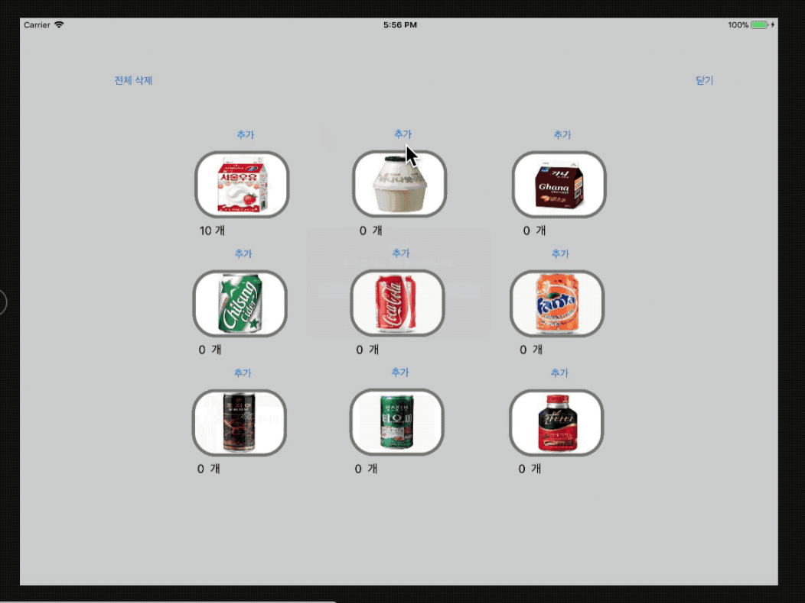

# # Step7. Frame과 Bounds

> 개발한 것(배운 것)

### 1. 음료 자판기 앱 사용자모드와 관리자모드 뷰 나누기
: VendingMachineApp step7에서는 기존에 ViewController에서 하나의 뷰에 음료 추가와 구매버튼을 두어 음료 자판기 앱 사용자모드와 관리자모드를 둘 다 넣어두었는데, 이를 분리하는 작업을 했다.
뷰 단에서는 버튼과 라벨을 복사 및 분리했고, 관리자모드로 가는 버튼을 추가했다.  



### 2. prepare(for segue: UIStoryboardSegue, sender: Any?)
: 사용자모드와 관리자모드를 나누다보니 AppDelegate에서 ViewController로 의존성 주입으로 넣어준 vendingMachine 인스턴스를 ManagerViewController에서는 사용할 수 없다는 문제점이 생겼다.  
그래서 
```swift
override func prepare(for segue: UIStoryboardSegue, sender: Any?) {
    if let admin = segue.destination as? ManagerViewController {
        admin.vendingMachine = vendingMachine
    }
}
```

> 피드백

https://github.com/dely2p/swift-vendingmachineapp/issues/52  
https://github.com/dely2p/swift-vendingmachineapp/issues/53  
https://github.com/dely2p/swift-vendingmachineapp/issues/54  
https://github.com/dely2p/swift-vendingmachineapp/issues/55  


> 알게 된 것

### 1. Notification.Name 선언  
: Notification.Name 선언을 해서 사용하면 하드 코딩을 하지 않아도 된다.(더 깔끔한 코드)

```swift
 NotificationCenter.default.post(name: Notification.Name("changeInventoryBox"), object: self)
```

↓ 코드 개선함

```swift
NotificationCenter.default.post(name: Notification.Name.DidResetInventoryBox, object: self)
```
  
### 2. 노티를 받을 때 데이터를 넘겨받고 싶으면?
: NotificationCenter.default.post() 매개변수로 UserInfo를 두어 데이터를 넘겨받을 수 있다.

```swift
let someInfomation: [String: Int] = ["test", 0]
NotificationCenter.default.post(
					name: NSNotification.Name(rawValue: "notificationName"), 
                    object: nil, 
                    userInfo: someInfomation)
)
```

또한 넘겨받은 데이터를 사용할 때는 NSNotification type의 매개변수를 이용하여 데이터를 가져올 수 있다.

```swift
func changeInventoryBox(_ notification: NSNotification){
        if let data = notification.userInfo as Dictionary {
               if let result = data["test"] {
                       print(result) // 0
               }
        }
}
```

참고 문서: https://stackoverflow.com/questions/36910965/how-to-pass-data-using-notificationcentre-in-swift-3-0-and-nsnotificationcenter
https://developer.apple.com/documentation/foundation/nsnotification/1409222-userinfo