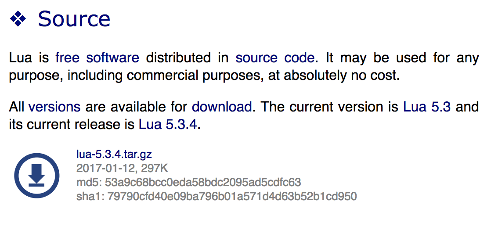
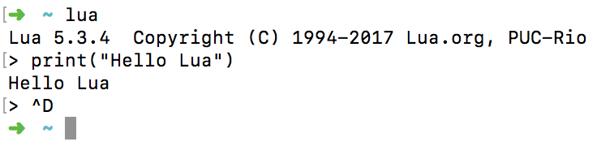

# Lua

- 포르투갈 언어로 `달`이라는 의미
- 1993년도에 개발된 루아는 처음에는 C언어 같은 전통적인 언어로 작성된 소프트웨어와 통합할 의도로 설계되었다. C언어로 구현하기에는 복잡한 기능들을 루아로 손쉽게 제공하기 위함이었다. 그래서 Lua 이전의 DEL과 SOL을 결합하여 좀 더 심플한 언어를 만들었다.

  
	루아는 하드웨어와의 독립성, 자동 메모리 관리, 좋은 문자열 관리 등.. 데이터 크기를 동적으로 관리해 줄 수 있어 앵그리버드 같은 게임에도 쓰이고, 내가 쓰고자하는 스티커 개발에도 쓰인다.

  	
	루아를 공부하던 중 개인적으로 놀란 부분은 x, y = y, z 처럼 swap을 쉽고, 빠르게 할 수 있다는 것이었다. 학부시절 C언어에서 swap을 배우려면 C언어의 꽃 포인터를 배워야 했기 때문이었다.
	
	
### 설치(mac기준)
- 루아 홈페이지 https://www.lua.org/download.html 에서 다운로드를 받거나 터미널에서 다음 명령어를 입력한다. (참고로 나는 5.3.4 버전)  

	
	
	```
	$ curl -R -O http://www.lua.org/ftp/lua-5.3.4.tar.gz
	$ tar zxf lua-5.3.4.tar.gz
	$ cd lua-5.3.4
	$ make macosx
	$ sudo make install
	$ lua -v
	```
	
### 실행
- 터미널에서 사용하려면 `lua`라고 입력하면 된다. 끝낼 땐 control + d  

	
	
- 스크립트 에디터를 Atom과 vsCode를 둘 다 설치해보았다.  
개인적으로는 Atom을 설치하고 lua에 필요한 확장팩을 설치해서 사용중인데.. 출력창이 너무 작다; 이거 크기를 늘릴 수는 없는건가.. vsCode는 mono 에러가 떠서 사용못하는중..  
(추후 고치면 내용 추가 예정)
- 인프런 Atom 사용법 쭉 듣고 쓰면 좋다.(꿀팁!)  

  

> 그럼 이제 Lua를 시작해보자