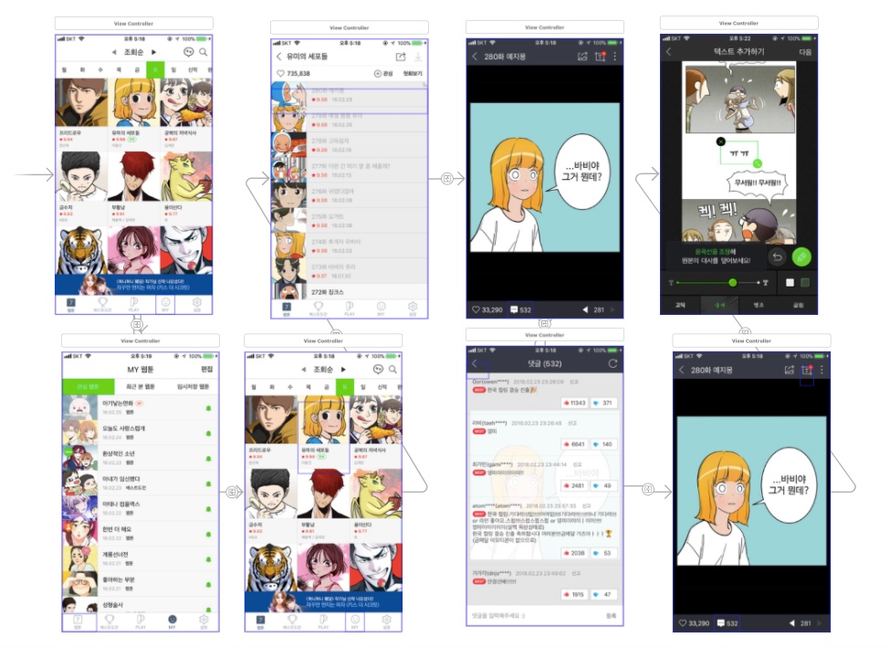

# # To do List

- JK강의


# # What I Learned
  
### episode 1. JK강의
  
---

- iOS SDK<br  />
: 라이브러리 vs 프레임워크: 사용할 때 의존성의 관계(라이브러리: 참조해서 쓰기만할 수 있는 것-간단함(의존성 만들필요 없음) / 프레임워크: 필요한 메소드를 호출하여 동작 완성시킴(의존성 구현해줘야 함))<br  />
빌드 시 테스트 할 수 있는 현재 버전 시뮬레이터와 직전 버전 시뮬레이터 모두 들어있음.

- iOS<br  />
Cocoa Touch / Media / Core Services / Core OS<br  />

- Human Interface Guidelines<br  />
: Save 아이콘의 의미를 모든 사람이 이해할 수 없는 시대<br  />
이제는 현실의 메타포를 경험한 사람이 스마트폰을 사용하는 것이 아니라 스마트폰의 메타포를 사용하는 사람이 현실을 경험하는 시대<br  />
(flat 디자인, 텍스트 중심)<br  />

- UX<br  />
: 참고사이트<br  />
iOS Design Patterns(http://pttrns.com/)<br  />
http://instpired-ui.com<br  />
http://www.lovelyui.com<br  />
http://mobile-patterns.com<br  />
https://dribbble.com<br  />
user habit: 사용자들이 앱에서 무엇을 많이 눌렀는지 알려주는 사이트<br  />

1. 리서치: 퍼소나(Persona)<br  />
: 시장조사를 위해 대표적인 타겟을 정하고 직접 만나서 리서치하고 인터뷰해서 근거자료로 씀<br  />
개발 기간과 예산을 정함<br  />

2. 디자인 워크숍<br  />

3. 임시 Prototype 만들기: Wireframe 도구를 활용하여 RITE(Rapid Interactive Testing and Evaluation)<br  />

4. 시각 디자인: 실제 UI 요소 디자인과 애니메이션 처리<br  />

5. 앱 디자인 작업: 아이콘, 스플래시, 레이아웃, 컴포넌트, 슬라이스 가이드<br  />
(스케치, 제플린)<br  />

6. View 만들기<br  />

- Design: 의도한 설계(디자인적인 설계- 사용자가 어떻게 쓸지, 내부를 어떻게 해야할 지)<br  />
처음 만들 때부터 설계해야함<br  />
기능의 목록을 모으지말고 솔루션을 정의하라(ADS: Application Definition Statement) - 고객을 위한 자신만의 차이점, 자신의 솔루션<br  />

- 짝미션: 앱을 하나 고르고 분석, ADS 작성, 화면 캡처해서 스토리보드에 이미지뷰, 버튼 스토리보드 만들기<br  />


### episode 2. 네이버 웹툰 앱 분석 및 스토리보드 만들기

---

```
- 타겟: 
10대~40대 (20대의 비중이 가장 높음)

솔루션: 
- 웹툰보기
- 웹툰 올리기: 베스트 도전
- 웹툰 찾기
- 댓글기능
- 관심 웹툰만 보기
- 웹툰 컷 자르기

차별점(비교 앱: 다음웹툰): 
- 콜랙션 뷰를 사용하여 웹툰 목록을 구현하여 UI가 직관적이다.
- 웹툰 장면으로 짤을 만들 수 있다.

ADS:
- 10대에서 40대까지 누구나 모바일을 통해 웹툰을 볼 수 있고, 뿐만아니라 웹툰으로 짤을 만들 수 있다.
```




### episode 3. 생각

---

- 오랜만에 iOS 수강동기들을 만났다. 다들 못본 새 꿀피부가 되어있어서 부러웠다. 나는 2월동안 뭔가 열심히 한듯 안한듯하여 부끄럽기도 했다. (꿀피부라도 될 걸..ㅠ) <br  />
  JK가 UX강의를 해주셨다. 예전에 UXID에서 배우고 실습했던 생각이 났다. UX는 재미나기도 하고 생각할 것이 참 많은 분야인 것 같다. 뭔가 하나의 앱에 가치관과 존재의 의미를 부여하는 것 같아서 신비롭기도 하다. 나중에 기회가 된다면 그쪽 분야로 공부해보고 싶다.


