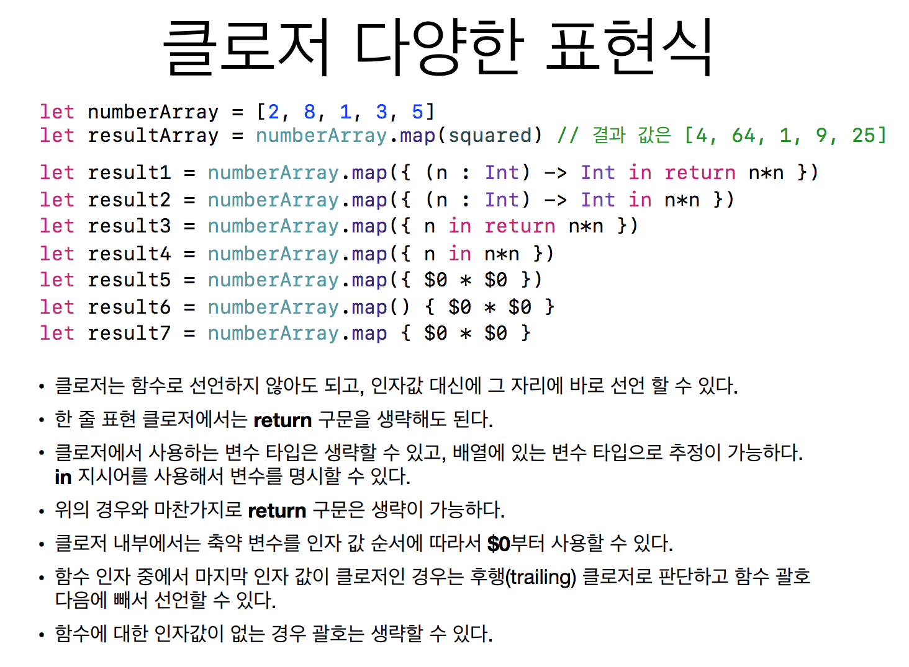

# # To do List

- VendingMachineApp step2 PR 받고 수정하기 [완료]
- VendingMachine step1, 2 블로그에 정리하기 [미완료]


# # What I Learned

### episode 1. JK 피드백 강의 (클로저)

---

- Indirect: 함수 개념이 없던 시절 코드를 통으로 짰었는데, 코드를 보관해 놓는 Subroutine이 생겨나게 되었다. 또한 변수와 포인터 개념도 생겨났다.<br  />
클로저: Indirect의 더 나아간 개념. 함수를 값처럼 사용(함수 중심 프로그래밍) - 함수를 타입으로 지정, 인자값으로 넘김, 리턴값으로 받음(커링)<br  />
선언된 범위의 변수를 캡처해서 reference로 가지고 있음(Objective-C는 value로 갖고 있어서 값을 바꿀 수 없다)<br  />
```swift
var intValue = 10
let increment = {
    (n:Int) in
    intValue = intValue + n
}
increment(5)
print(intValue) //15
```
<br  /><br  />
<br  />

고차함수(high-order function)


http://public.codesquad.kr/jk/Feedback-20180312.pdf<br  />
(Jake가 공유해준 토요일 세미나 자료: https://www.slideshare.net/ChiwonSong/20180310-functional-programming)


### episode 2. 생각

---

- 지난 코드도 다시보자<br />
VendingMachine에서 Type to Beverage가 없는지 모르고 한참 헤맸다ㅠㅠ
