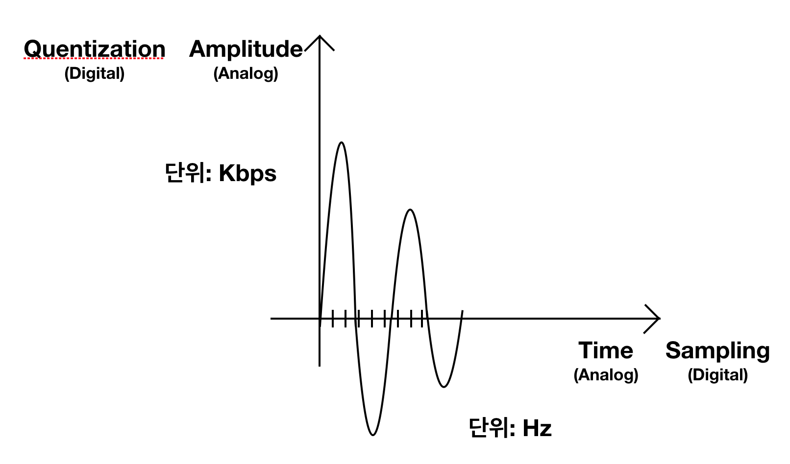

# # To do List

- VendingMachineApp step3 ObjectIdentifier encode, decode 처리하기 [완료]
- readme.me file 정리 [미완료]

# # What I Learned

### episode 1. JK강의(모바일 컴퓨팅)

---

- 모바일 컴퓨팅 
모바일 컴퓨팅은 단지 모바일 프로그래밍만이 아님. 
dynabook(앨런케이-제럭스 연구소): small talk 개발(객체지향프로그래밍) 
모바일 컴퓨팅: 언제든지 어디서나 어떤 것이든 네트워크에 연결되어 사용할 수 있는 컴퓨팅 환경 
hidden-figures(영화) / CODE(도서)
아날로그 vs 디지털 
  

### episode 2. 생각

---

- Hello ObjectIdentifier!