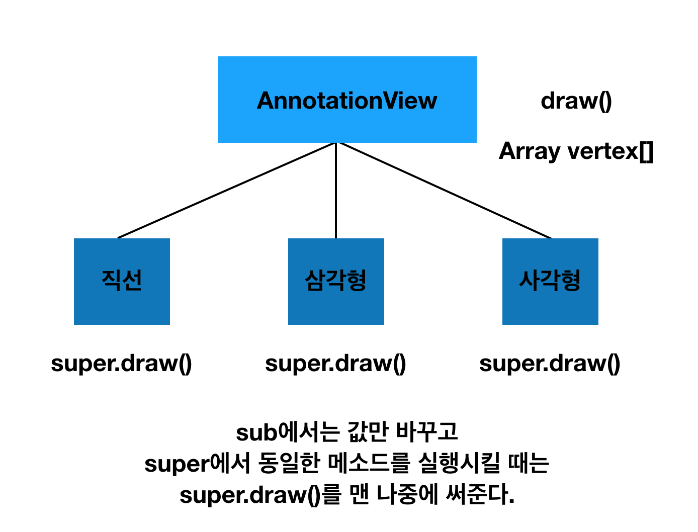

# # To do List

- VendingMachineApp step4 피드백 수정 후 PR [완료]
- VendingMachineApp step4 Observer 만들고 PR [완료]
- readme.md 작성 및 step3 배운점 정리 [미완료]


# # What I Learned

### episode 1. JK 강의(생성자 상속과 재정의)

---

- Initializer == Constructor<br  />
- init()의 종류<br  />
	- superclass : Designated - 인스턴스를 만들기 위해서 적어도 하나는 값을 넣어주는 것
Convenience - Designated를 불러서 생성하되 필요한 것들 넣어줌<br  />
	- subclass : super의 designated 호출, self의 convenience
	<br  /><br  />

- @ApplicationMain 대신 만들기
```
@UIApplicationMain == UIApplicationMain(CommandLine.argc, UnsafeMutablePointer(CommandLine.unsafeArgv).bindMemory(to: UnsafeMutablePointer<Int8>.self, capacity: Int(CommandLine.argc)), nil, NSStringFromClass(self))
```

- AppDelegate에서 storyboard 가져오기<br  />
```
window?.rootViewController = UIStoryboard.init(name: "Main", bundle: nil).instantiateViewController(withIdentifier: "my")
self.window?.makeKeyAndVisible()
```
- Button을 상속받아서 MyButton 로 공통적으로 사용하기 
awakeFromNib()
layoutSubView()
(super.layoutSubViews() 넣어야 함)

- NSObject <-UIResponder <- UIView 상속됨
: AppDelegate도 UIResponder를 상속받음

- Responder Chain : ViewA가 눌렀을 때 Hit-Test(어디가 눌렸는지 판단)를 하고 sender event를 호출함.(호출기준: 투명하지 않아야 함 - 수치상 0.13보다 불투명해야 됨)

### episode 2. 생각

---

- 계속 밀린다..ㅠㅠ 낼은 `정리의 시간`으로 지정해야할 듯