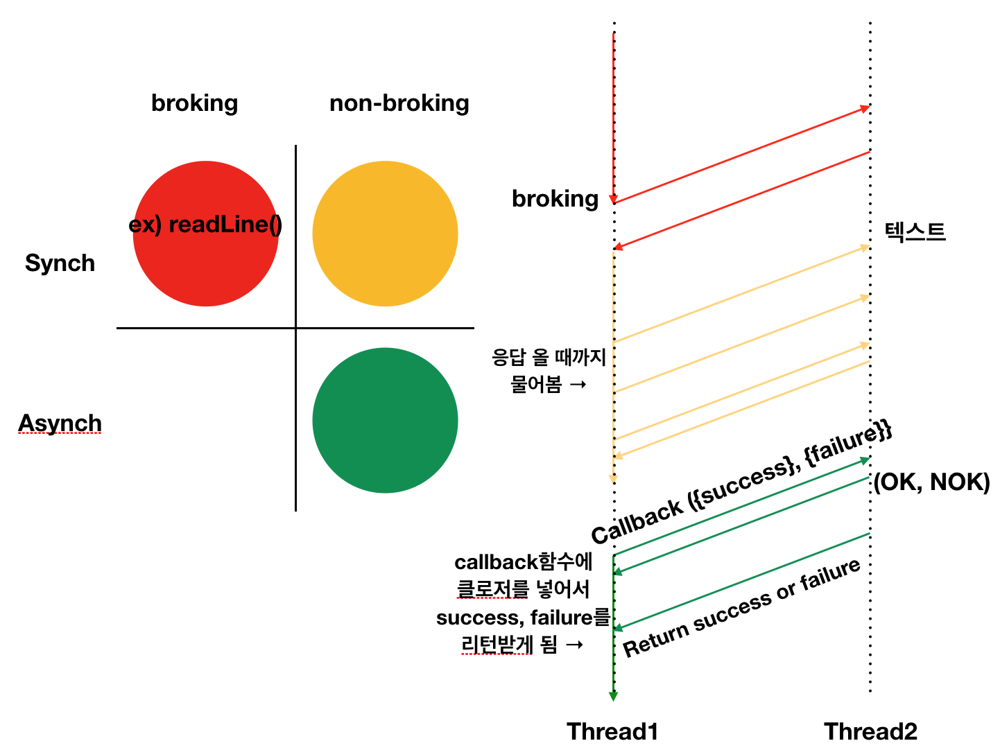

# # To do List

- VendingMachineApp step6 피드백 수정하기 [완료]

# # What I Learned

### episode 1. JK 강의 - brocking, nonbrocking, asynch, synch의 관계 (부제: RxSwift가 나오게 된 배경)

---

<br  /><br  />

Asynch & non-blocking에서 callback 함수에 클로저를 넣게 되는데, 이 클로저에 또 다른 클로저를 추가할 수도 있음. 그러한 복잡한 환경을 RxSwift가 해결해 주었다고 한다.

```swift
class ReadValue {
    var successClosure: ((String)->())? = nil
    var value: String = "" {
        didSet {
            if let closure = successClosure {
                closure(value)
            }
        }
    }
    func asyncRead(completed: @escaping (String)->()) {
        successClosure = completed
        DispatchQueue.global().async {
            self.value = readLine() ?? ""
        }
    }
}

var read = ReadValue()
read.asyncRead{(readValue) in
    print(readValue)
    exit(1)
}

```

코드 개선 ↓

```
import Foundation
class ReadValue {
    static func asyncRead( completed:@escaping (String)->() ) {
        DispatchQueue.global().async {
            let value = readLine() ?? ""
            completed(value)
        }
    }
}
var read = ReadValue()
ReadValue.asyncRead { (readValue) in
    print(readValue)
    exit(1)
}

while(true) {
    
}
```

@escaping: 탈출클로저

### episode 2. 생각

---

- 미세먼지.....😷